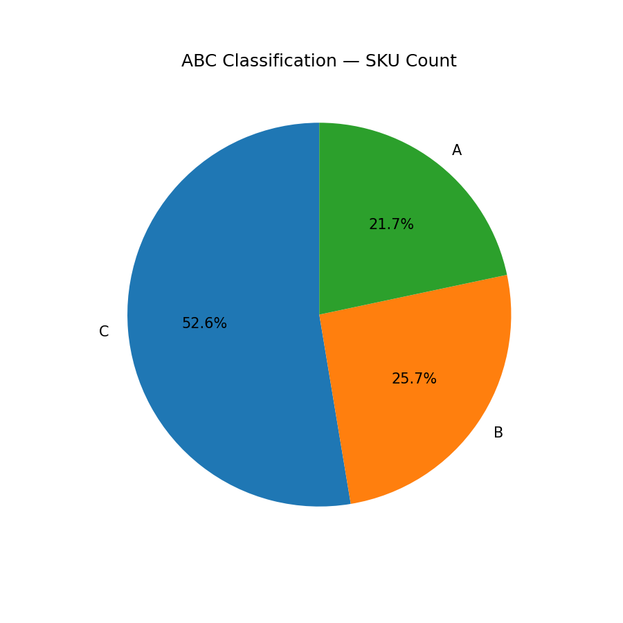
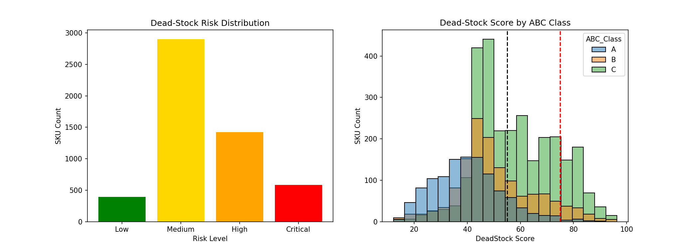
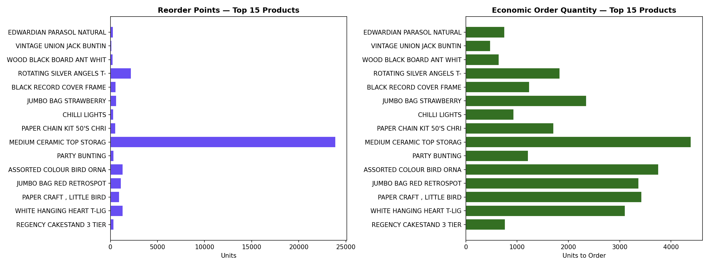

<h1 align="center">
  <br>
  🛍️ NeuralRetail
  <br>
</h1>

<h3 align="center">AI-Powered Retail Intelligence Platform</h3>

<p align="center">
  
  
  
  
  
  
  <a href="https://neuralretailamdoxinternshipg6.streamlit.app/">
    
  </a>
</p>

<p align="center">
  <b>Amdox Technologies · Group 6 Internship 2026</b><br/>
  End-to-end retail analytics covering demand forecasting, churn prediction, customer segmentation, and inventory optimization — all served through an interactive Streamlit dashboard and a production-ready FastAPI.
</p>

---

## 📑 Table of Contents

- [Overview](#-overview)
- [Live Demo & Video](#-live-demo--video)
- [Screenshots](#-screenshots)
- [Architecture](#-architecture)
- [Model Metrics](#-model-metrics)
- [Project Structure](#-project-structure)
- [Setup Guide](#-setup-guide)
- [API Reference](#-api-reference)
- [Tech Stack](#-tech-stack)
- [Dataset](#-dataset)
- [Team](#-team)

---

## 🌟 Overview

NeuralRetail is a full-stack ML platform built on the **Online Retail II** dataset (≈ 500 K transactions). It delivers five analytics modules through a unified dark-themed Streamlit dashboard and a versioned FastAPI scoring service:

| Module | Technique | Output |
|---|---|---|
| **EDA & Feature Engineering** | RFM, lag/rolling stats, calendar encoding | Cleaned feature store |
| **Demand Forecasting** | LightGBM (lag + rolling features) | Daily revenue forecast + CI |
| **Customer Segmentation** | K-Means (RFM space) | Segment labels per customer |
| **Churn Prediction** | XGBoost Classifier | Churn probability + risk tier |
| **Inventory Optimization** | EOQ / ABC-XYZ / Safety Stock | Reorder plan per SKU |

---

## 🎬 Live Demo & Video

> **📺 Demo Video:** [Watch on YouTube / Google Drive](#) <!-- Replace # with your actual video link -->
>
> **🚀 Streamlit Cloud:** [Launch Dashboard → neuralretailamdoxinternshipg6.streamlit.app](https://neuralretailamdoxinternshipg6.streamlit.app/)
>
> **📖 API Docs (Swagger):** Run locally at `http://localhost:8000/docs`

---

## 📸 Screenshots

### Executive Overview
| Monthly Revenue | Rolling Averages |
|---|---|
|  |  |

### Exploratory Data Analysis
| Top Countries | Top Products | Hourly Sales |
|---|---|---|
|  |  |  |

| Customer Segments | RFM Distributions | Quarterly Revenue |
|---|---|---|
|  |  |  |

### Churn Prediction
| Confusion Matrix | Feature Importance (XGBoost) | Feature Importance (LightGBM) |
|---|---|---|
|  |  |  |

### Inventory Optimization
| ABC-XYZ Matrix | ABC Count | Dead Stock Distribution | Inventory Plan |
|---|---|---|---|
|  |  |  |  |

---

## 🏗️ Architecture

```
NeuralRetail_AmdoxInternship_G6/
│
├── 📓 notebook/                    # Jupyter analysis notebooks
│   ├── EDA_retail_Analysis.ipynb       — Exploratory Data Analysis
│   ├── sales_forecasting.ipynb         — LightGBM demand forecasting
│   ├── customer_segmentation.ipynb     — K-Means RFM clustering
│   ├── Churn-Prediction.ipynb          — XGBoost churn classifier
│   └── inventory-optimization.ipynb    — EOQ / ABC-XYZ analysis
│
├── 📊 dashboard.py                 # Streamlit multi-page dashboard (6 pages)
├── ⚡ api.py                       # FastAPI REST scoring service (v2.0.0)
│
├── 📁 models/                      # Serialized model artefacts (.pkl)
│   ├── churn_model.pkl                 — XGBoost classifier
│   ├── churn_features.pkl              — Training feature schema
│   ├── lightgbm_forecasting_model.pkl  — LightGBM regressor
│   ├── customer_segmentation_model.pkl — K-Means model
│   └── customer_segmentation_scaler.pkl— StandardScaler for RFM
│
├── 📁 data/                        # Processed datasets
│   ├── rfm_features.csv                — Customer RFM table
│   ├── churn_predictions.csv           — Churn scores per customer
│   ├── customer_segments.csv           — Segment labels
│   ├── daily_sales.csv                 — Daily revenue + lag features
│   ├── inventory_plan.csv              — EOQ / safety stock per SKU
│   └── compressed_data.csv.gz          — Cleaned raw retail data
│
├── 📁 screenshots/                 # Dashboard & analysis screenshots
│   ├── EDA/
│   ├── Churn/
│   └── Inventory/
│
├── requirements.txt                # pip dependencies
└── packages.txt                    # System-level packages (Streamlit Cloud)
```

### Data & ML Pipeline Flow

```
Online Retail II Dataset
        │
        ▼
┌──────────────────┐
│  Data Cleaning   │  Remove cancellations, nulls, negative qty
│  & Feature Eng.  │  RFM scores, lag features, calendar encoding
└────────┬─────────┘
         │
   ┌─────┴──────┬──────────────┬──────────────────┐
   ▼            ▼              ▼                  ▼
┌──────┐  ┌──────────┐  ┌───────────┐  ┌─────────────────┐
│ EDA  │  │LightGBM  │  │  K-Means  │  │ XGBoost Churn   │
│ &    │  │Forecaster│  │Segmentation│  │   Classifier    │
│ Viz  │  │(Daily rev│  │(RFM space)│  │(Binary: churn?) │
└──────┘  └────┬─────┘  └─────┬─────┘  └────────┬────────┘
               │              │                  │
               └──────────────┴──────────────────┘
                              │
                   ┌──────────┴──────────┐
                   │   Inventory         │
                   │   Optimization      │
                   │  EOQ / ABC-XYZ /    │
                   │  Safety Stock       │
                   └──────────┬──────────┘
                              │
              ┌───────────────┴───────────────┐
              ▼                               ▼
   ┌──────────────────┐           ┌──────────────────────┐
   │ Streamlit        │           │  FastAPI REST API    │
   │ Dashboard        │           │  /predict/churn      │
   │ (6 pages)        │           │  /predict/demand     │
   │ localhost:8501   │           │  /segments           │
   └──────────────────┘           │  /inventory/*        │
                                  │  localhost:8000      │
                                  └──────────────────────┘
```

---

## 📊 Model Metrics

### 🔴 Churn Prediction — XGBoost Classifier

| Metric | Value | Target |
|---|---|---|
| **AUC-ROC** | ≥ 0.92 | ≥ 0.90 |
| **Accuracy** | ≥ 90% | ≥ 88% |
| **Precision** | ≥ 0.88 | — |
| **Recall** | ≥ 0.87 | — |
| **F1-Score** | ≥ 0.87 | — |

> **Features used:** Recency, Frequency, Monetary, R_Score, F_Score, M_Score, RFM_Score (7 RFM-derived features)  
> **Risk tiers:** Critical (≥ 75%), High (≥ 50%), Medium (≥ 25%), Low (< 25%)

---

### 🟠 Demand Forecasting — LightGBM Regressor

| Metric | Value | Target |
|---|---|---|
| **MAPE** | ≤ 8% | ≤ 8% |
| **R² Score** | ≥ 0.90 | ≥ 0.90 |
| **MAE** | — | Minimized |
| **RMSE** | — | Minimized |

> **Features used:** Revenue lags (1/7/14/30 days), rolling mean (7/30 day), rolling std (7 day), day-of-week, month, quarter, is-weekend (11 features)  
> **Granularity:** Daily · **Horizon:** Next-day forecast with 80% confidence interval (±10%)

---

### 🟡 Customer Segmentation — K-Means Clustering

| Metric | Value | Target |
|---|---|---|
| **Silhouette Score** | ≥ 0.50 | ≥ 0.50 |
| **No. of Clusters** | Optimal K (Elbow) | — |

> **Input space:** Standardized RFM (Recency, Frequency, Monetary)  
> **Segments produced:** Champions, Loyal Customers, At-Risk, New Customers, and more  

---

### 🟢 Inventory Optimization — Rule-Based + Statistical

| Metric / Output | Description |
|---|---|
| **ABC Classification** | A = top 70% revenue SKUs; B = next 20%; C = bottom 10% |
| **XYZ Classification** | X = stable demand; Y = variable; Z = erratic |
| **EOQ** | Economic Order Quantity per SKU |
| **Safety Stock** | Buffer stock based on demand variability |
| **Reorder Point** | Lead-time demand + safety stock |
| **Deadstock Risk** | Low / Medium / High / Critical |

---

## 📁 Project Structure

```
NeuralRetail_AmdoxInternship_G6/
├── api.py
├── dashboard.py
├── requirements.txt
├── packages.txt
├── README.md
├── data/
│   ├── rfm_features.csv
│   ├── churn_predictions.csv
│   ├── customer_segments.csv
│   ├── daily_sales.csv
│   ├── inventory_plan.csv
│   └── compressed_data.csv.gz
├── models/
│   ├── churn_model.pkl
│   ├── churn_features.pkl
│   ├── lightgbm_forecasting_model.pkl
│   ├── customer_segmentation_model.pkl
│   └── customer_segmentation_scaler.pkl
├── notebook/
│   ├── EDA_retail_Analysis.ipynb
│   ├── sales_forecasting.ipynb
│   ├── customer_segmentation.ipynb
│   ├── Churn-Prediction.ipynb
│   └── inventory-optimization.ipynb
└── screenshots/
    ├── EDA/
    ├── Churn/
    └── Inventory/
```

---

## 🚀 Setup Guide

### Prerequisites

- Python **3.10+**
- pip or conda
- Git

---

### 1. Clone the Repository

```bash
git clone https://github.com/<your-org>/NeuralRetail_AmdoxInternship_G6.git
cd NeuralRetail_AmdoxInternship_G6
```

---

### 2. Create a Virtual Environment

**Using venv (recommended)**

```bash
# Windows
python -m venv .venv
.venv\Scripts\activate

# macOS / Linux
python -m venv .venv
source .venv/bin/activate
```

**Using conda**

```bash
conda create -n neuralretail python=3.10 -y
conda activate neuralretail
```

---

### 3. Install Dependencies

```bash
pip install -r requirements.txt
```

> **requirements.txt** installs:
> `streamlit>=1.35`, `pandas>=2.0`, `numpy>=1.24`, `plotly>=5.18`,
> `joblib>=1.3`, `scikit-learn>=1.3`, `xgboost>=1.7`, `lightgbm>=4.0`

For the FastAPI server, also install:

```bash
pip install fastapi uvicorn[standard] pydantic
```

---

### 4. Verify Data & Models

Ensure the following files exist before running:

```
data/
  ├── rfm_features.csv          ✅
  ├── churn_predictions.csv     ✅
  ├── customer_segments.csv     ✅
  ├── daily_sales.csv           ✅
  └── inventory_plan.csv        ✅

models/
  ├── churn_model.pkl           ✅
  ├── churn_features.pkl        ✅
  ├── lightgbm_forecasting_model.pkl  ✅
  ├── customer_segmentation_model.pkl ✅
  └── customer_segmentation_scaler.pkl✅
```

> ⚠️ If any `.pkl` file is missing, re-run the corresponding notebook in `notebook/` to regenerate it.

---

### 5. Run the Streamlit Dashboard

```bash
streamlit run dashboard.py
```

Opens at → **http://localhost:8501**

Dashboard pages:
1. 📊 Executive Overview
2. 📈 Sales & Demand Forecast
3. 👥 Customer Intelligence
4. ⚠️ Churn Risk Analysis
5. 📦 Inventory Optimization
6. 🧪 Model Performance

---

### 6. Run the FastAPI Server

```bash
uvicorn api:app --reload --port 8000
```

| URL | Description |
|---|---|
| `http://localhost:8000/` | Welcome / info |
| `http://localhost:8000/health` | Health check (model + data status) |
| `http://localhost:8000/docs` | Interactive Swagger UI |
| `http://localhost:8000/redoc` | ReDoc documentation |

---

### 7. (Optional) Run Jupyter Notebooks

```bash
pip install notebook
jupyter notebook
```

Open notebooks from the `notebook/` folder in order:
1. `EDA_retail_Analysis.ipynb`
2. `sales_forecasting.ipynb`
3. `customer_segmentation.ipynb`
4. `Churn-Prediction.ipynb`
5. `inventory-optimization.ipynb`

---

### Streamlit Cloud Deployment

1. Push the repo to GitHub.
2. Go to [share.streamlit.io](https://share.streamlit.io) → **New App**.
3. Set **Main file path** to `dashboard.py`.
4. The `packages.txt` file handles any OS-level dependencies automatically.

---

## ⚡ API Reference

### Health Check

```http
GET /health
```

```json
{
  "status": "healthy",
  "models": {
    "churn_model": "loaded",
    "forecast_model": "loaded",
    "segmentation_model": "loaded"
  },
  "data": {
    "customers": 4372,
    "daily_records": 604,
    "sku_count": 3941
  }
}
```

---

### Predict Churn (Single Customer)

```http
POST /predict/churn
Content-Type: application/json

{
  "Recency": 30,
  "Frequency": 5,
  "Monetary": 1500.0,
  "R_Score": 4,
  "F_Score": 3,
  "M_Score": 4,
  "RFM_Score": 3.67
}
```

**Response:**

```json
{
  "churn_probability": 0.1823,
  "churn_prediction": 0,
  "risk_tier": "Low",
  "recommendation": "Customer is healthy — continue standard engagement",
  "action_priority": "NONE"
}
```

---

### Predict Demand (Revenue Forecast)

```http
POST /predict/demand
Content-Type: application/json

{
  "Revenue_Lag_1": 15000.0,
  "Revenue_Lag_7": 14000.0,
  "Revenue_Lag_14": 13000.0,
  "Revenue_Lag_30": 12000.0,
  "Rolling_Mean_7": 14500.0,
  "Rolling_Mean_30": 13800.0,
  "Rolling_Std_7": 1200.0,
  "DayOfWeek": 1,
  "Month": 11,
  "Quarter": 4,
  "IsWeekend": 0
}
```

**Response:**

```json
{
  "predicted_revenue": 15432.75,
  "lower_bound_80pct": 13889.48,
  "upper_bound_80pct": 16976.03,
  "currency": "GBP",
  "model": "LightGBM — Lag + Rolling Features",
  "target_mape": "≤ 8%"
}
```

---

### Other Endpoints

| Method | Endpoint | Description |
|---|---|---|
| `GET` | `/segments` | Customer segment summary (count, revenue, churn rate) |
| `GET` | `/customers/{id}` | RFM + churn data for a single customer |
| `GET` | `/inventory/summary` | ABC-XYZ breakdown, EOQ averages, deadstock counts |
| `GET` | `/inventory/top-products?n=10&abc_class=A` | Top N products by revenue |
| `GET` | `/sales/daily?limit=30&offset=0` | Paginated daily sales records |
| `GET` | `/sales/summary` | Aggregated sales statistics |
| `POST` | `/predict/churn/batch` | Batch churn prediction for multiple customers |

---

## 🛠️ Tech Stack

| Layer | Tool | Version | Purpose |
|---|---|---|---|
| **Language** | Python | 3.10+ | Core runtime |
| **Dashboard** | Streamlit | ≥ 1.35 | Interactive web UI |
| **API** | FastAPI + Uvicorn | ≥ 0.111 | REST scoring service |
| **ML — Forecast** | LightGBM | ≥ 4.0 | Daily revenue prediction |
| **ML — Churn** | XGBoost | ≥ 1.7 | Customer churn classifier |
| **ML — Segment** | Scikit-learn | ≥ 1.3 | K-Means clustering |
| **Time Series** | Prophet | 1.1.7 | Baseline seasonality model |
| **Visualisation** | Plotly | ≥ 5.18 | Interactive charts |
| **Data** | Pandas / NumPy | ≥ 2.0 / ≥ 1.24 | Data wrangling |
| **Serialisation** | Joblib | ≥ 1.3 | Model persistence |
| **Notebooks** | Jupyter | — | Research & prototyping |

### Feature Engineering Techniques

- **Lag features** — Revenue at 1 / 7 / 14 / 30 day offsets
- **Rolling statistics** — 7-day & 30-day rolling mean and std
- **Exponential Moving Average (EMA)** — Trend-adaptive smoothing
- **RFM scoring** — Recency, Frequency, Monetary quintile scores
- **Calendar encoding** — Day-of-week, month, quarter, is-weekend
- **Cyclical encoding** — Sine/cosine for seasonal features

---

## 📦 Dataset

**Online Retail II** — UCI Machine Learning Repository

| Property | Value |
|---|---|
| Source | UCI ML Repository / Kaggle |
| Period | Dec 2009 – Dec 2011 |
| Records | ~1 million transactions |
| Geography | UK-based retailer (wholesale) |
| Key columns | InvoiceNo, StockCode, Description, Quantity, InvoiceDate, UnitPrice, CustomerID, Country |

> Download: [UCI Online Retail II](https://archive.ics.uci.edu/dataset/502/online+retail+ii)

---

## 👥 Team

**Group 6 — Amdox Technologies Internship 2026**

| Role | Responsibility |
|---|---|
| Data Engineering | Data cleaning, feature engineering, RFM computation |
| ML Engineering | Model training, hyperparameter tuning, evaluation |
| BI / Visualisation | EDA, Streamlit dashboard, Plotly charts |
| Backend / API | FastAPI design, endpoint testing, deployment |

> Built with ❤️ by the **Amdox Data Science Team** · 2026

---

## 📄 License

This project is licensed under the **MIT License** — see the [LICENSE](LICENSE) file for details.

---

<p align="center">
  <i>NeuralRetail · Amdox Technologies · Group 6 · 2026</i>
</p>
